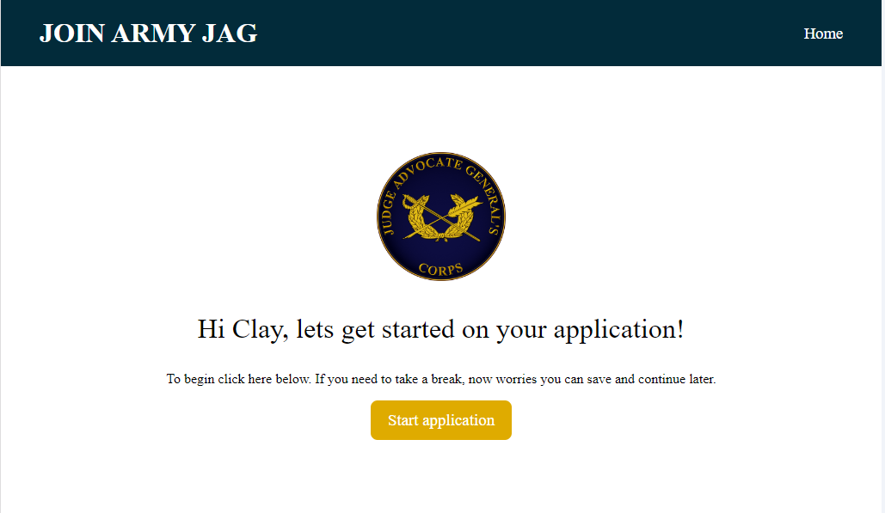
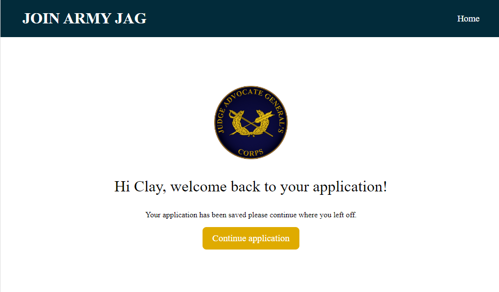
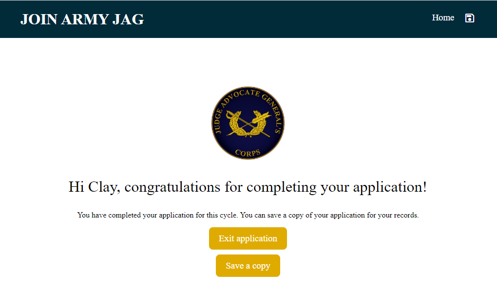

# Online-Alternative-View

# Table of Contents
- [Online-Alternative-View](#online-alternative-view)
- [Table of Contents](#table-of-contents)
  - [GitHub Username](#github-username)
  - [Email](#email)
  - [Description:](#description)
  - [Usage](#usage)
  - [Built-With](#built-with)
  - [Licenses](#licenses)
  - [Deployed](#deployed)

## GitHub Username
[Mike Sowers](https://github.com/msowers72)

## Email
<msowers72@yahoo.com>

## Description:
Welcome, pages for new and returning Judge Advocate General prospects.

## Usage
As a user, I can submit an online application for membership in the U.S.ARMY'S Judge Advocate General's Coprs or continue an existing application.

## Built-With
* HTML
* CSS

   

## Licenses 

<!--  -->
  
 ## Deployed
 [Online Application](https://msowers72.github.io/Log-In-Form/)
 
 
  
  
  
 

